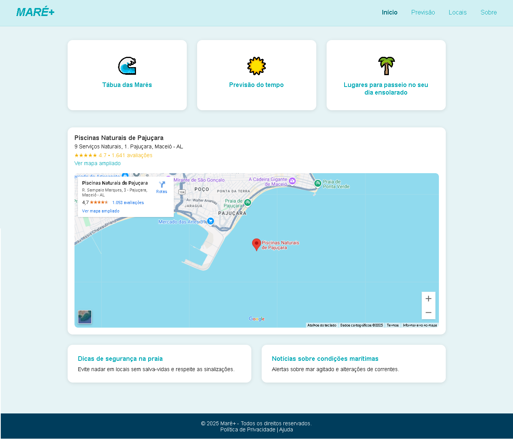
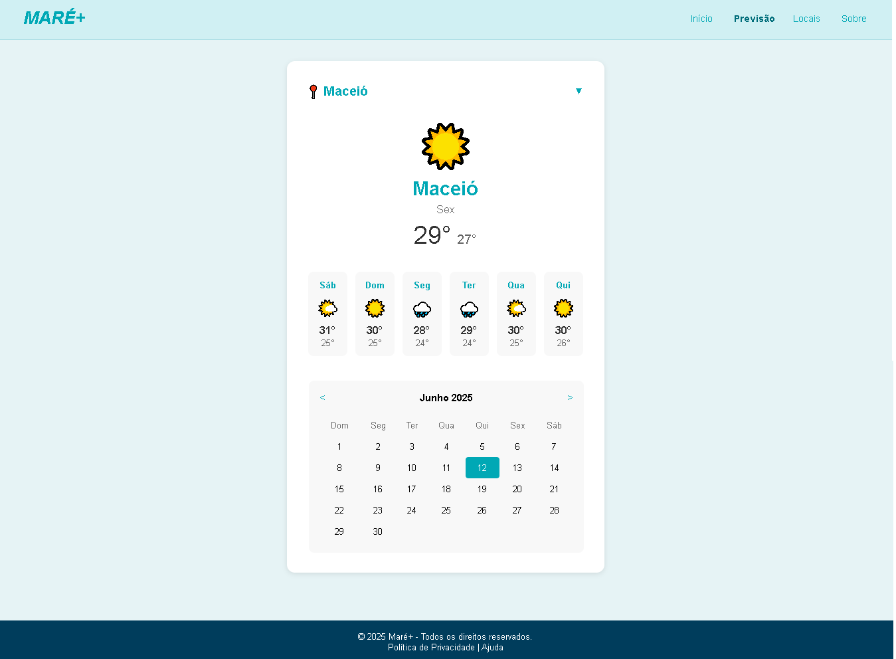
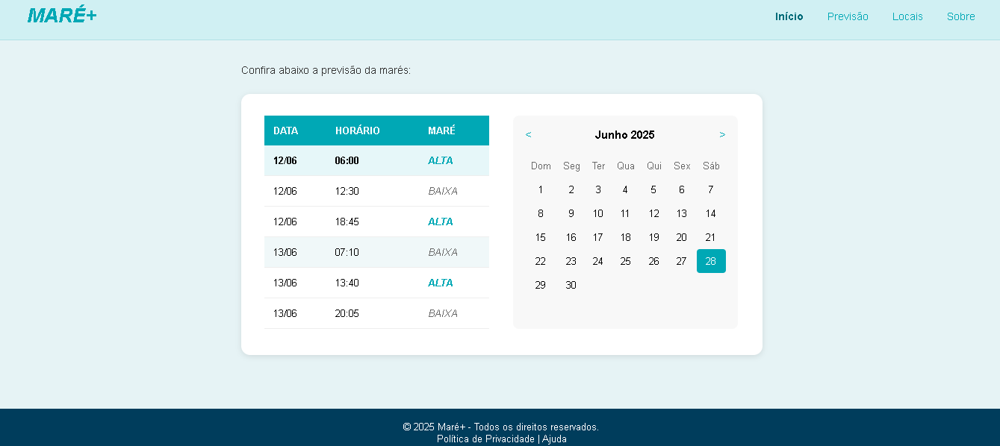
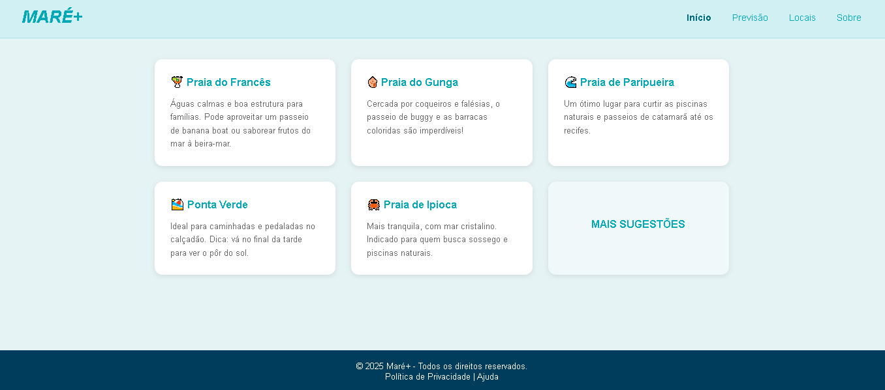
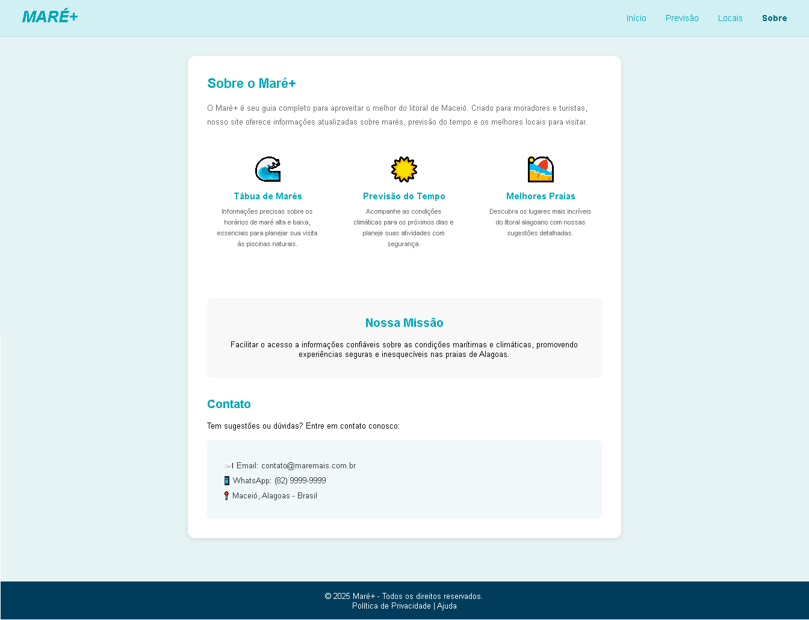
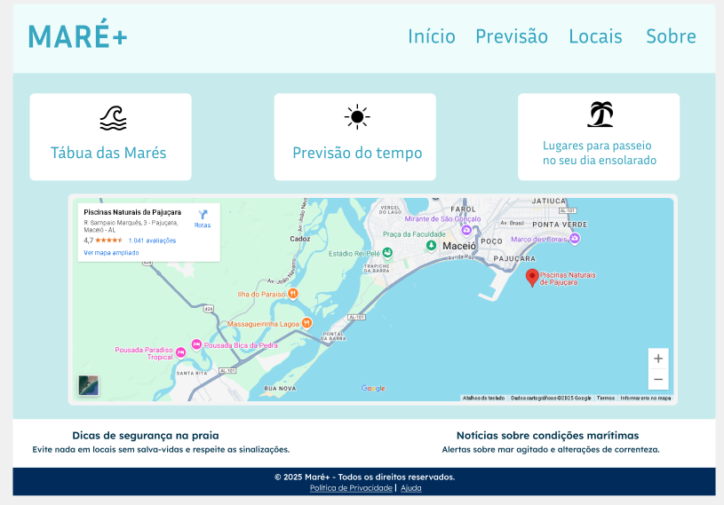
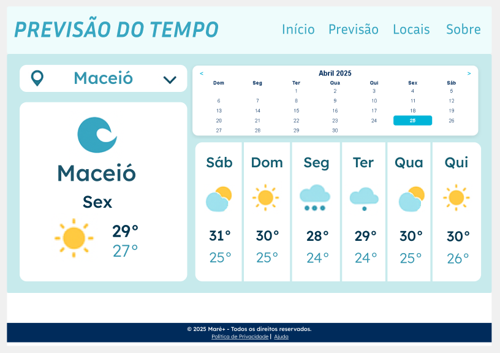
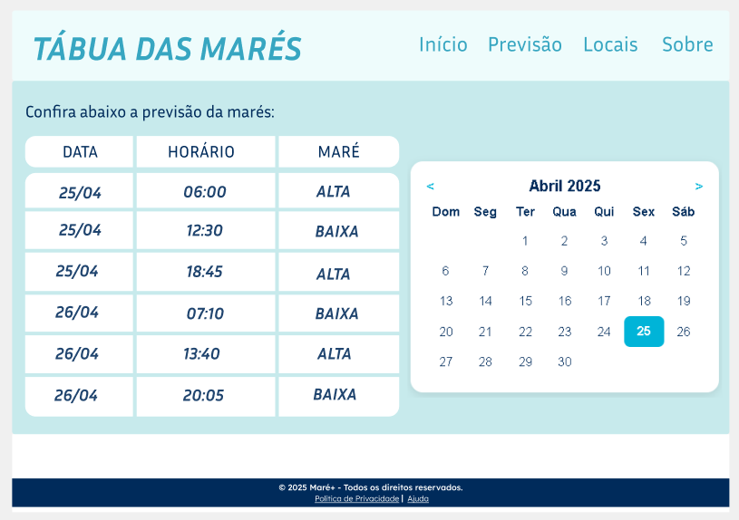
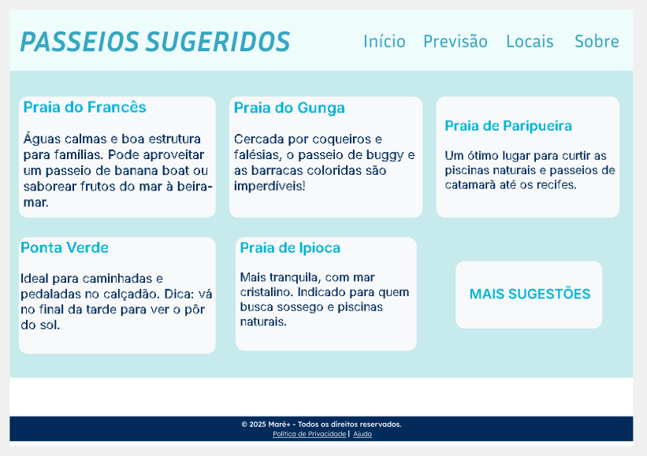

# MARÉ+

MARÉ+ é um projeto desenvolvido como trabalho final da disciplina de Interação Humano-Computador (IHC). Seu objetivo é apresentar uma interface mais limpa, acessível e organizada para usuários interessados em consultar informações sobre marés e clima e tábua das mares nas praias de Maceió, Alagoas.

## Acesse o site

Você pode visualizar o protótipo publicado aqui: [Mare+](https://arthurfeitoza.github.io/ProjetoIHC/)

## Imagens do Site

### Página Inicial

### Página de Previsão  

### Página Tábua das Mares

### Página de Locais

### Página Sobre

## Imagens do protótipo no Figma

### Página Inicial (Figma)

### Página de Previsão (Figma)

### Página Tábua das Mares (Figma)

### Página de Locais (Figma)

## Contexto

Site de referência original: [Tábua de Marés - Maceió](https://tabuademares.com/br/alagoas/maceio)

O site escolhido oferece informações importantes para turistas e moradores de cidades litorâneas, como tábua de marés e previsão do tempo. No entanto, sua interface atual é poluída, pouco intuitiva e visualmente desorganizada, dificultando o acesso rápido às informações.

## Objetivo do Projeto

O projeto MARÉ+ tem como objetivo aprimorar a experiência do usuário por meio de um protótipo que reestrutura a apresentação das informações, tornando-as mais claras e acessíveis. A proposta inclui uma navegação intuitiva e um layout visualmente harmonioso, fundamentado no protótipo criado no Figma durante a disciplina de Interação Humano-Computador (IHC).

## Importante

Este projeto é apenas um protótipo e não possui todas as funcionalidades completas, como dados em tempo real de maré ou previsão do tempo. O foco está na proposta de interface e estrutura de navegação.

## Tecnologias Utilizadas

- HTML5  
- CSS3  
- JavaScript  
- Google Maps Embed (para visualização da localização)

## Funcionalidades Simuladas

- Navegação entre páginas (Início, Previsão, Locais e Sobre)  
- Seções ilustrativas com sugestões de praias  
- Mapa interativo com localização de Maceió  
- Conteúdo informativo sobre segurança e alertas marítimos

## Disciplina

Trabalho final da disciplina de **Interação Humano-Computador (IHC)**  
Curso: **Ciência da Computação**  
Instituição: *UNIMA - Centro Universitário de Maceió*  
Autores: Arthur Martins e Quézia Souza
